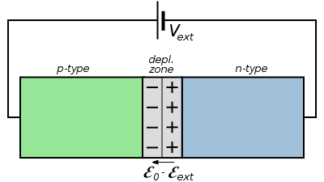
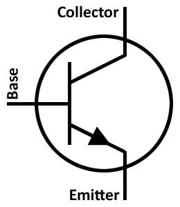

# HPC Intro
---


--


---

Logical AND


---

## Закон на Мур

> Броят на транзисторите в един чип се удвоява приблизително всеки 12/18/24 месеца

Валиден ли е все още ?

---


---

Да, но ...

---

Нещо се случва през 2005


---


Защо компютрите вече не стават по-бързи ?

* Не стават ли ?

* До преди 2005 - на всеки Х месеца броят на транзисторите се удвоява по закона
  на Мур

* Това се случва посредством намаляне на размера на транзистора на чипа двойно

* Когато чипът е два пъти по-малък можем да вдигнем честотата два пъти

---

* size **L1 = L/2**

* voltage **V1 = V/2**

* frequency **F1 = 2F**

* density **D1 = 4D**

* power = **L \* V \* V \* F **
 * **P1 = 1/2 \* (1/2 \* 1/2 \* 2 \*2 \* 2)**
 * => **P1 = P**

 Обаче ...

---

Поради физични явления, вече не можем да намаляме **V**. Тоест ..


* size **L1 = L/2**

* voltage  <span style="color:red;">**V1 = V/2**</span>

* frequency **F1 = 2F**

* density **D1 = 4D**

* power = **L \* V \* V \* F **
 * **P1 = 1/2 \* 2 \*2 \* 2**
 * => <span style="color:red;">**P1 = 4P**</span>


---

**Static Power** - leakage of transistors while being inactive

**Dynamic Power** - energy needed to switch gate

---

 

---

Ват на кв. см. в микропроцесорите

 

---


---

# Как работи процесора ?

---

1. Fetch
2. Decode
3. Execute
4. Write-back


---

Има **3 начина** да получим по-голяма производителност - и това не се отнася
само до програмирането, ами изобщо

1. Работи по-усърдно / Work Harder

2. Работи по-умно / Work Smarter

3. Повикай помощ / Get Help

---

В контекста на процесорите:

1. Увеличена честота

2. Кешове / branch prediction / out of order / etc

3. Multicore / ILP / Auto SIMD

---


1. Валът на мощността

2. Валът на паметта

3. Валът на имплицитният паралелизъм 


---

Pipeline

Do the CPU phases in parallel - write back result, as executing something else,
as decoding 3rd, as fetching 4th ..


Problem : dependencies ...

---

Resolving dependencies

```
       for (int i = 0; i < numItems; ++i) {
            x = y[i] * z;    /// <----
            q += z + x + x;
            x = a + b;       /// <----
        }

        //////////////

        for (int i =0 ; i < numItems; ++i) {
            float x0 = y[i] * z;
            q += z + x0 + x0;
            x = a + b;
        }
```

---

Resolving dependencies in **reduction**
```
for (int i = 0; i < size; ++i)
    m = max(arr[i], m);
```
Lets unroll ..
```
for (int i = 0; i < size / 4; i+=4) {
    m = max(arr[i], m);
    m = max(arr[i+1], m); /// <----
    m = max(arr[i+2], m); /// <----
    m = max(arr[i+3], m); /// <----
}
```
Fixed:
```
m0=m1=m2=m3=-inf;
for (int i = 0; i < size/4; i+=4) {
    m0 = max(m0, arr[i+0]);
    m1 = max(m1, arr[i+1]);
    m2 = max(m2, arr[i+2]);
    m3 = max(m3, arr[i+3]);
}
m = max(m0, m1, m2, m3);
```


---

бел.ред:
plans for the next slides - introduction to
Instruction Level Parallelism
ILP wall
Memory Caches
Memory wall
SIMD
следващите слайдове за сега са разбъркани и следва да бъдат подредени ...

---


| Old        | New           |
| ------------- |:-------------:|
| Power is free, transistors are expensive      | Power Wall |
| Only dynamic power counts    | Static leakage is 40%      |
| Multiply is slow, load-and-store is fast | Memory wall      |
| ILP get better all the time, load-and-store is fast | ILP wall |
| Parallelization is not worth it | 75% per year before, 15% per year now    |
| Processor frequency goes up every X months | Number of cores goe up every X months      |

---

* Single core performance per year ~(2 to 15)% per year

* Multicore performance increase ~75% per year

---

FMAD double = 50pj

Moving 64b 1mm = 25pj

___


64b 10mm = 250pj

64b "off chip" = 1000pj

64b DRAM = 10000pj

12 TFLOPS ?= 300W
___

*"ALUs are like kids these days - easy to acquire, hard to feed" (B. Dally)*

---

“The Free Lunch Is Over: A Fundamental Turn Toward Concurrency in Software”
(2005, Sutter)

“30x CPU performance increases in the next 50 years” (2500x for the last 30
years)

“100 GHz CPU == Чип с размер 2 милиметра”

**Производителност = Паралелизъм**

**Ефикасност = Локалност**

Еднонишково оптимизираните процесори (и езици!) са отрицание на това ("светът е
плосък")

---

## Производителност = Паралелизъм

___

## Ефикасност = Локалност

---

>“Software does not run in a magic fairy ether powered by the fevered dreams of
>CS PhDs” Branimir Karadzic


