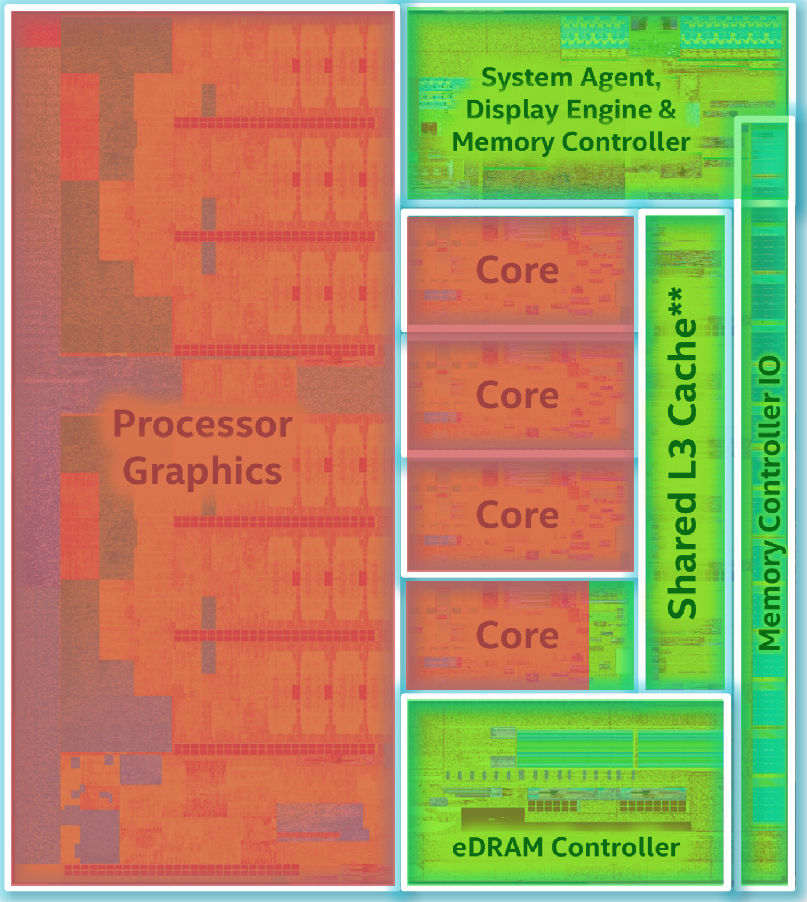
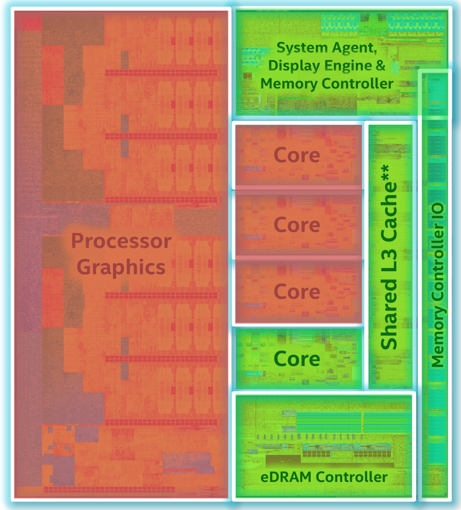
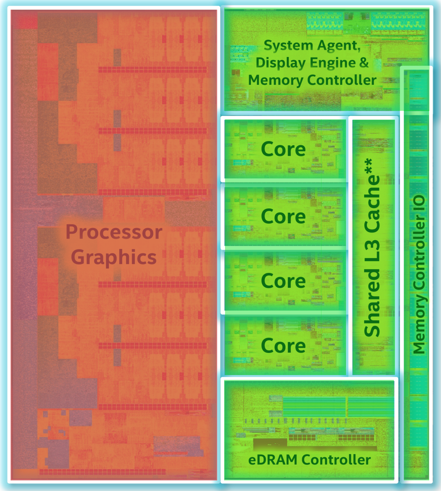
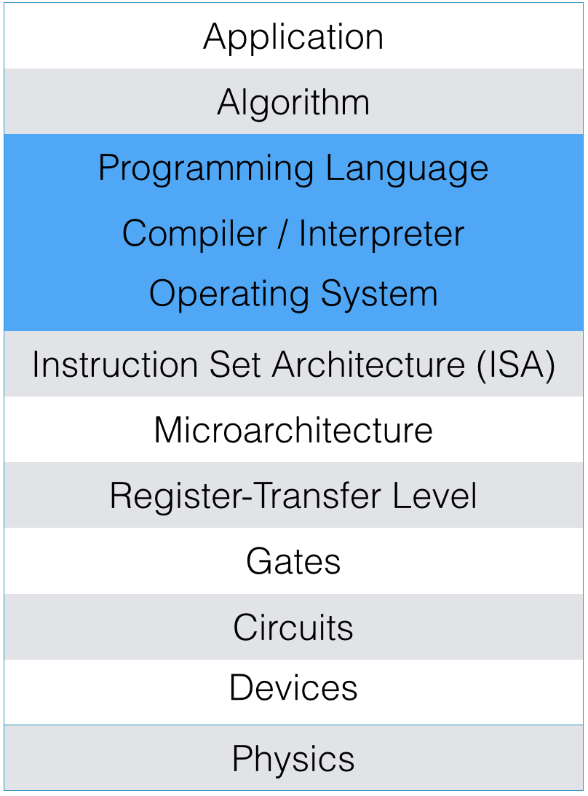
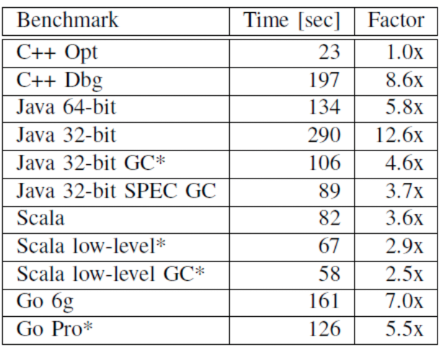
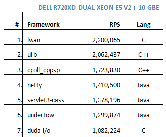
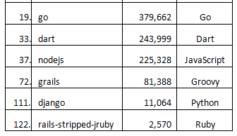

# FMI HPC 15

---

* За нас

* За курса

* За оценяването

---

# За Нас

---

## Димитър Трендафилов

Masthead MMORPG Game Engine Dev

Coherent Labs - Co-Founder

Advanced C++

@dimitarcl

trendafilov.dn@gmail.com

---

* СУ/ФМИ/2009

* Masthead Studios 2009-2012

* Coherent Labs since 2012

---

## Благовест Тасков

http://code-bg.com

http://github.com/savage309

@savage309

taskov@gmail.com

---

* СУ/ФМИ/2011

* Masthead 2009-2011

* Chaos Group 2011-continues

 * **V-Ray RT GPU (CUDA & OpenCL)**

* Other

 * F.U.T.

---

## Guests

* Мартин Енев (Google)

* Стоян Николов (Coherent Labs)

* Мартин Кръстев, Иван Комитов (Chaos Group)

---

# За Курса

---

# Изисквания

* Английски език

* С, С++ (УП, ООП, СДП, advanced)

* Операционни системи

* Компютърни архитектури

* Специален хардуер не е необходим, но част от примерите, които ще разгледаме могат да бъдат тествани само на nVidia видеокарти.

* Специална операционна система не е необходима (Windows, Linux или OS X). За препоръчване е да имате поне две от трите.

---

## Защо да не записвате този курс

 * Дава малко кредити

 * Труден е

 * С други технологии (JS) се печели повече

 * Никой софтуер/курс версия 1.0 не е небъгав. Ще бъдете използвани за бета тест.

 * Ако бъдете хванат да преписвате ще пропуснете ПОНЕ една година акамичен живот
   * Важи както за изпити/контролни, така и за проекти/домашни

---

## Ако бъдете хванат да преписвате ще пропуснете ПОНЕ една година академичен живот

Няма да бъде направен **нито един компромис**

---

## Защо да запишете този курс

* Темите които ще разгледаме се разглеждат и в други (не лоши) курсове във ФМИ.
  Практиката на други университети показва обаче, че е полезно тези теми да
  бъдат разгледани и във взаимносвързан контекст

* Фундаментален за приложения като игри

* Климатични модели

* Финансови/Био/Химични симулации

---

* Мобилни устройства

* Фото и видео обработка

* Виртуална реалност (VR)

* Автомобили и роботика

* Самообучаващи се системи

---

>"Programs must be written for people to read, and only incidentally for machines to execute" Harold Abelson

* Ние обаче ще се фокусираме върху код, на който му се случва често (> 20 милиона пъти в секунда) да се изпълнява (и пише) от машини.

* Ще си говорим за хардуер (може би повече, от колкото трябва), но в контекста на програмите, които той изпълнява.

* Хардуера, а не софтуера определят посоките, в които да се развива индустрията. И софтуера винаги догонва.

* Ще пишем код, ще ползваме инструменти за профилиране и дебъгване.

---

---

---

---

---

---

### Организационни

twitter: **@HPC_FMI**

mail: <trendafilov.dn / taskov> <@> <gmail.com>

github: **https://github.com/savage309/HPC2015**

---

 * Лекциите ще бъдат качвани online
  * Точки за contribution в github repo-то.
  * Присъствието не е задължително, освен при провеждането на тестовете (ако не присъствате получавате 0 точки)
  * Учебник няма. Презентациите са изключително бедни на съдържание (слайдовете са с по няколко думи).
    
 * Ще опитаме да имаме и видео записи в youtube, но е силно вероятно да не
   успеем за първата година на курса.

---

* Няма упражнения и ще се води в **традиционна форма** (т.е. идва някой, чете
  текст от слайдове и си тръгва).

* Курс в **дискусионна форма** (т.е. идва някой, говори си с вас, докато на
  заден фон вървят слайдове) изглежда по-добра идея, но не знаем
  точно как се прави (понеже сме имали само курсове от традиционният тип) и не
  мислим, че можем да се справим добре с него.

* Но **въпроси по всяко време** са добре дошли.  Ще получите **бонус точки**,
  ако преценим че въпросът е бил добър

---

## What is HPC

 * HPC = High Performance Computing

 >High Performance Computing most generally refers to the practice of
 >aggregating computing power in a way that delivers much higher performance
 >than one could get out of a typical desktop computer or workstation in order
 >to solve large problems in science, engineering, or business

---

HPC курс следва да се състои от две фундаментални части:

* Програмиране на системи със споделена памет

* Програмиране на системи без споделена памет

Ние ще разгледаме **само** програмирането на системи **със** споделена памет.

---

По принцип "HPC" се ползва като термин, когато се говори за **програмиране на
суперкомпютри**.

В "медиите" обаче се ползва и като буквалното му значение, а именно "изчисления
за висока производителност", или иначе казано **"да направим нещо да работи
бързо"**. Заглавието на този курс също е с "медийното" значение.

Няма да програмираме суперкомпютри.

---

## What is HPC FMI 15

  * Big O(n) notation

    * Окей за математика, не толкова окей за програмиране

  * Not-Big-O-Based-Optimizations

  * С други думи - ще забързваме програми без да променяме техните алгоритми

---

---

Защо С/С++ ?

> <a href="https://days2011.scala-lang.org/sites/days2011/files/ws3-1-Hundt.pdf">Loop Recognition in C++/Java/Go/Scala</a>

In this benchmark done by Google - C++ is **6 times** faster compared to Java

---

LWAN (C) is **>9 times** faster compared to nodejs (JS)

---

>"Improving the Facebook PHP JIT Compiler by 1% translates in many years of salary for our best paid engineers" Andrei Alexandrescu

---

## Съдържание

1. Computers
2. Single threaded program execution
3. SIMD
4. Roof line (1)
5. Multithreading
6. GPU
7. Tools

---

1. How computers work

---

2. Single threaded programs

* Cache-friendly
* Soa vs aos
* Pointer aliasing
* Loop unrolling

---

3. SIMD

---

4. Roof line (1)

---

5. Multithreading

* Hardware & execution
* Mutex
* Parallel programs
* patterns - singleton
* data structures - queue,
* algorithms
* Task based
* APIs

---

8. GPU

* GPU hardware
* APIs for programming GPUs
* GPU design patterns
* Developing, debugging and optimizing GPU programs

---

9. Tools

---

#### References

* HPI ("Parallel Programing Concepts", Peter Troger)
* MIT OpenCourseWare 6.172 (Fall 2010)
* ETH Zurich (How to Write Fast Numerical Code, Markus Puschel)
* Princeton, Computer Architecture (D. Wentzlaff)
* Stanford (course "Programming Massively Parallel Processors")
* lighterra.com (website)
* Andrew S. Tanenbaum books (all)
* C++ Concurency in action (book)

---

#### References

* The Art of Concurency (book)
* High Performance Computing (Charles Sevarance, Kevin Dowd) (book)
* Programming massively parallel processors (book)
* OpenCL Programming Guide (book)
* Compilers: Principles, Techniques, and Tools (book)
* What every programmer should know about memory (paper)
* Wikipedia

---

### Оценяване

* Изпит **50%**
     * В случай, че сте свикнали на обратното - оценяването няма да е на база
       брой изписани страници
     * Освен код, може да се наложи да бъдат писани дефиниции и теореми

* Проект **30%**

* Домашни **20%**
 * Домашните могат да са във формата на 10 минутен тест.
 * Кога ще бъде провежден тест ще е ясно предварително.

* +Бонуси

---

# Въпроси ?

