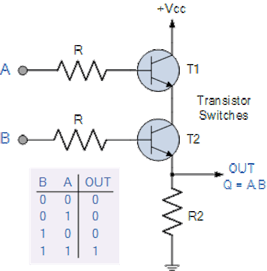
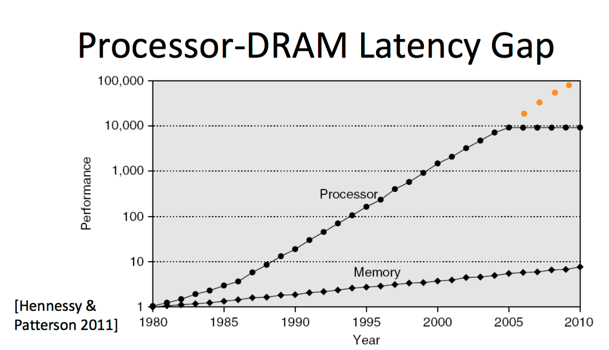
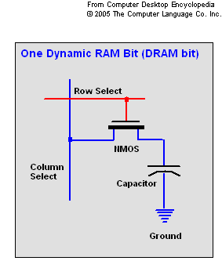
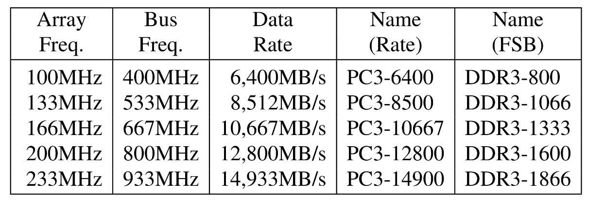
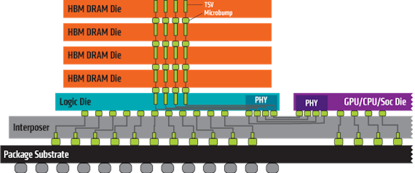

# HPC Intro

>“Software does not run in a magic fairy ether powered by the fevered dreams of
>CS PhDs” Branimir Karadzic

--

1. Hardware recap

---


--


---

Logical AND



---

## Закон на Мур

> Броят на транзисторите в един чип се удвоява приблизително всеки 12/18/24 месеца

Валиден ли е все още ?

---


---

Да, но ...

---

Нещо се случва през 2005


---


Защо компютрите вече не стават по-бързи ?

* Не стават ли ?

* До преди 2005 - на всеки Х месеца броят на транзисторите се удвоява по закона
  на Мур

* Това се случва посредством намаляне на размера на транзистора на чипа двойно

* Когато чипът е два пъти по-малък можем да вдигнем честотата два пъти

---

* size **L1 = L/2**

* voltage **V1 = V/2**

* frequency **F1 = 2F**

* density **D1 = 4D**

* power = **L \* V \* V \* F **
 * **P1 = 1/2 \* (1/2 \* 1/2 \* 2 \*2 \* 2)**
 * => **P1 = P**

 Обаче ...

---

Поради физични явления, вече не можем да намаляме **V**. Тоест ..


* size **L1 = L/2**

* voltage  <span style="color:red;">**V1 = V/2**</span>

* frequency **F1 = 2F**

* density **D1 = 4D**

* power = **L \* V \* V \* F **
 * **P1 = 1/2 \* 2 \*2 \* 2**
 * => <span style="color:red;">**P1 = 4P**</span>


---

**Static Power** - leakage of transistors while being inactive

**Dynamic Power** - energy needed to switch gate

---

 

---

Ват на кв. см. в микропроцесорите

 

---


---

# Как работи процесора ?

---

Straight forward:

1. Fetch
2. Decode
3. Execute
4. Write-back


---

Има **3 начина** да получим по-голяма производителност - и това не се отнася
само до програмирането, ами изобщо

1. Работи по-усърдно / Work Harder

2. Работи по-умно / Work Smarter

3. Повикай помощ / Get Help

---

В контекста на процесорите:

1. Увеличена честота

2. Кешове / branch prediction / out of order / etc

3. Multicore / ILP / Auto SIMD


---

Pipeline

Do the CPU phases in parallel - write back result, as executing something else,
as decoding 3rd, as fetching 4th ..


Какви проблеми може да създаде това ?

---

Resolving dependencies

```
       for (int i = 0; i < numItems; ++i) {
            x = y[i] * z;    /// <----
            q += z + x + x;
            x = a + b;       /// <----
        }

        //////////////

        for (int i =0 ; i < numItems; ++i) {
            float x0 = y[i] * z;
            q += z + x0 + x0;
            x = a + b;
        }
```

---

Resolving dependencies in **reduction**
```
for (int i = 0; i < size; ++i)
    m = max(arr[i], m);
```
Lets unroll ..
```
for (int i = 0; i < size / 4; i+=4) {
    m = max(arr[i], m);
    m = max(arr[i+1], m); /// <----
    m = max(arr[i+2], m); /// <----
    m = max(arr[i+3], m); /// <----
}
```
Fixed:
```
m0=m1=m2=m3=-inf;
for (int i = 0; i < size/4; i+=4) {
    m0 = max(m0, arr[i+0]);
    m1 = max(m1, arr[i+1]);
    m2 = max(m2, arr[i+2]);
    m3 = max(m3, arr[i+3]);
}
m = max(m0, m1, m2, m3);
```


---

Lets assume we live in a perfect world, where CPUs are not power limited.

How fast can a CPU go ? 

---

100ghz sounds fair

100ghz = 100 000 000 000 hz = 1e11hz -> 1e-11s (= 0.01ns)

Най-дългото разстояние, което може да бъде преминато за това време е 1е-11s * 300km/s = 3mm

---

## 3mm

Максималната честота е ограничена от скороста на най-бавният елемент в конвейра(пайплайна).

---

Superpipelined processors


Какви проблеми може да създаде това ?

---

ILP - Instruction Level Parallelism

Super scalar processors

"Широчина на процесор"


Какви проблеми може да създаде това ?

---

Superpipelined Superscalar Processor


---

Resolving dependencies compile time ...

* Structural dependencies

* Data dependencies

* Controll dependencies

---

Data dependencies detection is expensive.

Black Silicon (N.B. **SILICON != SILICONE**)

---

VLIW 


Old AMD GPUs

nVidia Tegra K1

Intel Itanium

Elbrus

---


1. Валът на мощността (power wall)

2. Валът на паметта (memory wall)

3. Валът на имплицитният паралелизъм (ILP wall)


---


| Old        | New           |
| ------------- |:-------------:|
| Power is free, transistors are expensive      | Power Wall |
| Only dynamic power counts    | Static leakage is 40%      |
| Multiply is slow, load-and-store is fast | Memory wall      |
| ILP get better all the time, load-and-store is fast | ILP wall |
| Parallelization is not worth it | 75% per year before, 15% per year now    |
| Processor frequency goes up every X months | Number of cores goe up every X months      |

---

* Single core performance per year ~(2 to 15)% per year

* Multicore performance increase ~75% per year

---

FMAD double = 50pj

Moving 64b 1mm = 25pj

___


64b 10mm = 250pj

64b "off chip" = 1000pj

64b DRAM = 10000pj

12 TFLOPS ?= 300W
___

*"ALUs are like kids these days - easy to acquire, hard to feed" (B. Dally)*

---

“The Free Lunch Is Over: A Fundamental Turn Toward Concurrency in Software”
(2005, Sutter)

“30x CPU performance increases in the next 50 years” (2500x for the last 30
years)

“100 GHz CPU == Чип с размер 2 милиметра”

**Производителност = Паралелизъм**

**Ефикасност = Локалност**

Еднонишково оптимизираните процесори (и езици!) са отрицание на това ("светът е
плосък")

---

## Производителност = Паралелизъм

___

## Ефикасност = Локалност

---

## Ефективно, ефикасно или производително ? Има ли разлика въобще ?

---



---

RAM is slow, so lets put faster caches near to the CPU

Automatically caches memory and instructions                                    
                                                                      


---


---

Why don't we put only caches ?

Speed of light - bigger the cache, longer the latency

From CPU to RAM (~30cm) and back takes 2ns !

SRAM vs DRAM vs GDRAM vs eDRAM vs HBM ?

---


SRAM
 
 * 6 transistors
 
 * May run on CPU clocks 
 
 * Fast, but hot
 
DRAM

 * 1 transistor, 1 capacitor (production of C is nice)
  
 * Much slower (<300MHZ as of today)
 
 * Slow, but dense

---




---

In a nutshel - two significantly different technologies

Both of them implemented as a 2D array (**reduce distance**)

Reading from DRAM goes through the **DMA and FSB** 
Row & Column ID, decode. Reading a row is faster.

"My computer has **1033/1600/1866MHZ**, so you guys are talking about some DRAMs for the past, right?"

---

## Wrong.



It is just marketing done well.

---

Okay, so what about GDRAM and eDRAM ?


---

HBM



---


---

Classifying Caches

* Fully Associative

* Set Associative 

* Direct Mapped

---

#Micro-optimizations

---

```
float x, y, z;
x = atan2(e0, e1);
y = atan2(e0, e1);
z = atan2(e0, e1);
```

Is there a problem with that ?

---

LLVM coding style guide


```
#include <iostream>

std::cout << "Hello world";
```


>The use of #include <iostream> in library files is **hereby forbidden**

Why ?

---

Types of Data Hazards

Data-dependence (**Read-after-Write**):
0. a + b -> c
1. c + d -> e

Anti-dependence (**Write-after-Read**):
0. a + b -> c
1. d + e -> a

Output-dependence (**Write-after-Write**):
0. a + b -> c
1. d + e -> c

What about (Read-after-Read) ?

---

#[DEMO ILP]

#[DEMO CACHES]

---

Translation Look-aside Buffer (**TLB**) maintains a small list of frequently used memory pages and their locations; addressing data that are location on one of these pages is much faster than data that are not. Consequently, one wants to code in such a way that the number of pages accessed is kept low.

What is the **page size** in the modern OSs ?

---

Branch Predictor
```
if (a) {
    //...
} else {
    //...
}
```

```
eval(A)

if (!A) {
    jmp p1
}

//code A
jmp p2
p1:
... code !A
p2:
```

---

```
#if !defined(_MSC_VER) || defined(__INTEL_COMPILER)
    #define   likely(expr) __builtin_expect((expr),true )
    #define unlikely(expr) __builtin_expect((expr),false)
#endif //!defined(_MSC_VER) || defined(__INTEL_COMPILER)
```

```
while (likely(flag1 == 0)) { ... }
//
if (unlikely(x == 0)) { ... }
```

---

Pointer aliasing


---

```
void add(int* restrict ptrA, 
         int* restrict ptrB, 
         int* restrict val) 
{
    *ptrA += *val;
    *ptrB += *val;
}
```

C++ ? Fortran ?

---

#[DEMO POINTER ALIAS]

---

IF vs SWITCH
```
switch(i) {
    case 0: doZero(); break
    case 1: doOne();
    case 2: doTwo(); break
    default: doOther();
}
```

```
if greater, jmp to DEFAULT
compare REG to 0
if less jmp to DEFAULT
jmp to table[REG]
data table
ZERO
ONE
TWO
end data
ZERO: call doZero
jmp END
ONE: call doOne
TWO: call doTwo
jmp END
DEFAULT: call doDefault
END:
```

---

Sometimes compiler makes jump table from IFs too.

As usual, if this is really important, don't trust the compiler and code the jump table by yourself.

---

What about i++ vs ++i ?

```
self_type operator++() { 
    self_type i = *this; 
    ptr_++;
    return i;
}

self_type operator++(int junk) { 
    ptr_++; 
    return *this; 
}
```

Usually doesn't matter, compiler are often smart.

But go for **++i**.

---

Inlining is the root of all optimizations

```
void changeSaturation(T *R, T *G, T *B, T change) {
    T P=sqrt(
        (*R)*(*R)*Pr+
        (*G)*(*G)*Pg+
        (*B)*(*B)*Pb ) ;

    *R=P+((*R)-P)*change;
    *G=P+((*G)-P)*change;
    *B=P+((*B)-P)*change; 
}
```

```
float r, g, b, c;
r = g = b = c = 0.f;
changeSaturation(&r, &g, &b, &c);
printf("%f\n", r + g + b + c);
```

---

#[DEMO INLINING]

---

All of this - caches, branch predictor, out of order execution, register renaming, etc is done to hide the latency to the memory.

Are there any other completely different approaches ?

---

Compilers 

* cl (MSVS)

* icc (Intel)

* gcc 

* clang 

* others

---


---


* Link time code generation 

* Whole program optimization 

* Link Time Optimization


---


All in one cpp

```
//file unity_build.cpp
#include "first.cpp"
#include "second.cpp"
//...
#include "last.cpp"
```

Pros : 0 link time, fast compilation, possibly faster code (why?)

Cons : hard to maintain

---

Memory alignment
```
for (int i = 0; i < 4096; ++i) {
    printf("%p\n", new int);
}
```

```
template <typename T>
struct Node {
    T* left; T* right;
    bool something, somethingElse;
};

template<typename T>
struct Node {
T* left, right;
Т* getLeft() const { //make getRight() too
    T* tempPtr = left;
    setFlag(tempPtr, 0, 0);
    setFlag(tempPtr, 1, 0);
    return tempPtr;
}
bool getSomething() const { return getFlag(left, 0); }
bool getSomethingElse() const { return getFlag(left, 1); }
void setSomething(bool foo) { setFlag(left, 0, foo); }
void setSomethingElse(bool foo) { setFlag(left, 1, foo); }
};
```

---

We have to reset the last 2 bits every time when we use the ptr.

Some architectures are **ignoring** them.

---

To const or not to const ?

```
float temp = a + b;
for (int i = 0; i < size; ++i)
    fooBar(temp)
```

```
const float temp = a + b;
for (int i = 0; i < size; ++i)
    fooBar(temp)
```

---

It doesn't matter for the compiler

(the compiler knows better than you what is const and what is not)

**const** could however make the code safer, so use it

---

What about **virtual** ? How is it implemented ?

Usually compiler transfer **foo.bar()** to [jump] and **foo.x** to [addr + offsetof(x)]. Where should virtual jump is known runtime only.


---

1st 64bit used for pointer to vtable (= cache miss)

can't be inlined (since what has to be executed is know only runtime)

```
#define SLOW virtual
class Bar {
    SLOW void test() const;
};
```

The **virtual** keyword is the fundament of OOP.

Think **twice**     before using OOP (more on that after few weeks)

---

#[DEMO VIRTUAL]

---

Devirtualizer

```
struct A {
    virtual int foo (void) {return 42;}
};
int test() {
    struct A a, *b=&a;
    return b->foo();
}
```

Inlining + Constant propagation + Dead code removal + Inliner + Dead code removal

```
int test() () {
    return 42;
}
```

---

Conclusion

* Single threaded performance is not getting any faster

* In the past it was hard to make complex app, but it was getting faster year after year.

* Now, sophisticated apps are easier to make (use SophisticatedAdd.js). Fast apps are *not*.

* Most of the people think that the computers are so fast, that there is no point in in-depth optimizations. As we saw, it is exactly *the opposite*.

* You need max performance per thread, use all the threads & use any extra compute units if you want to do more.

---

# Q&A
