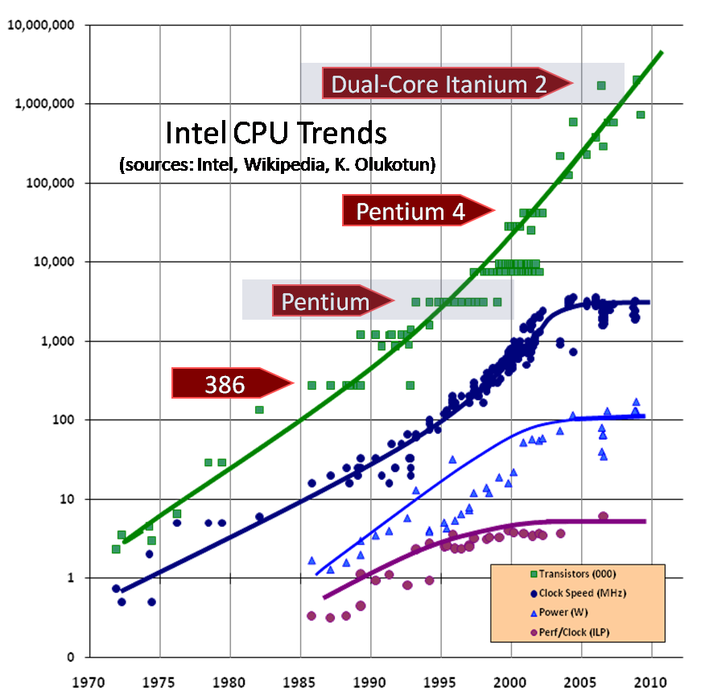
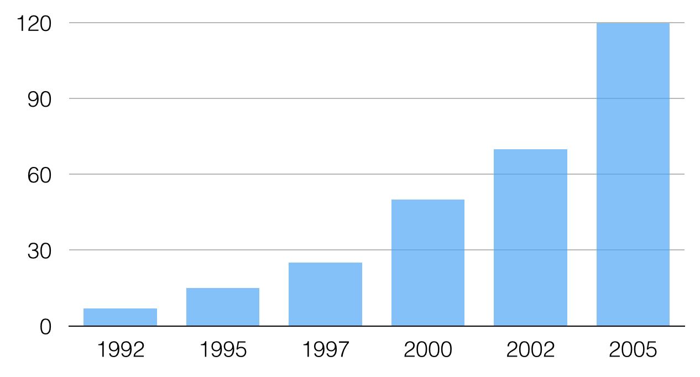
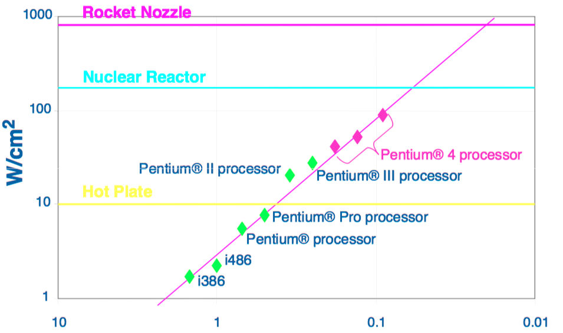
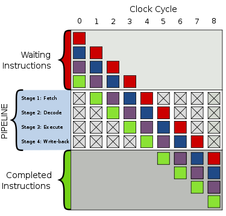
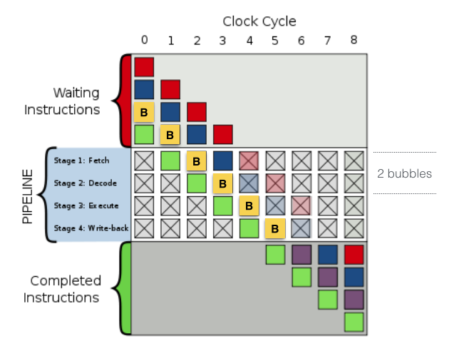
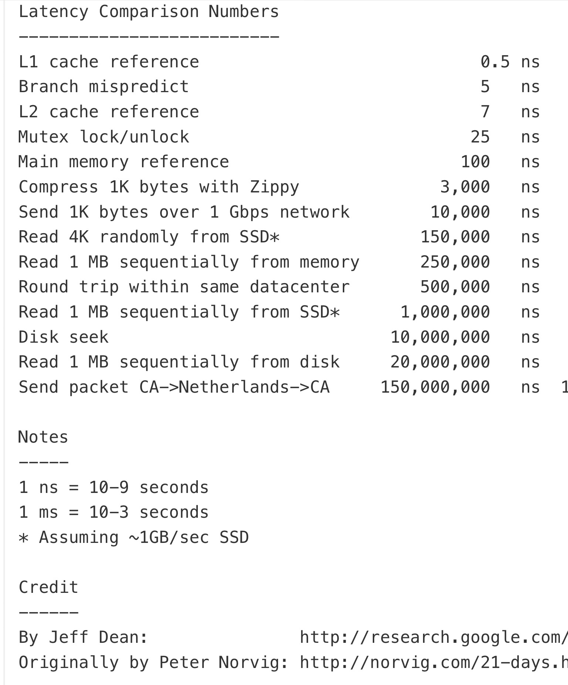
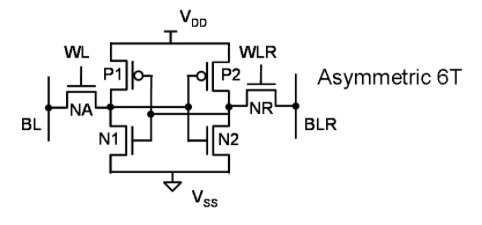
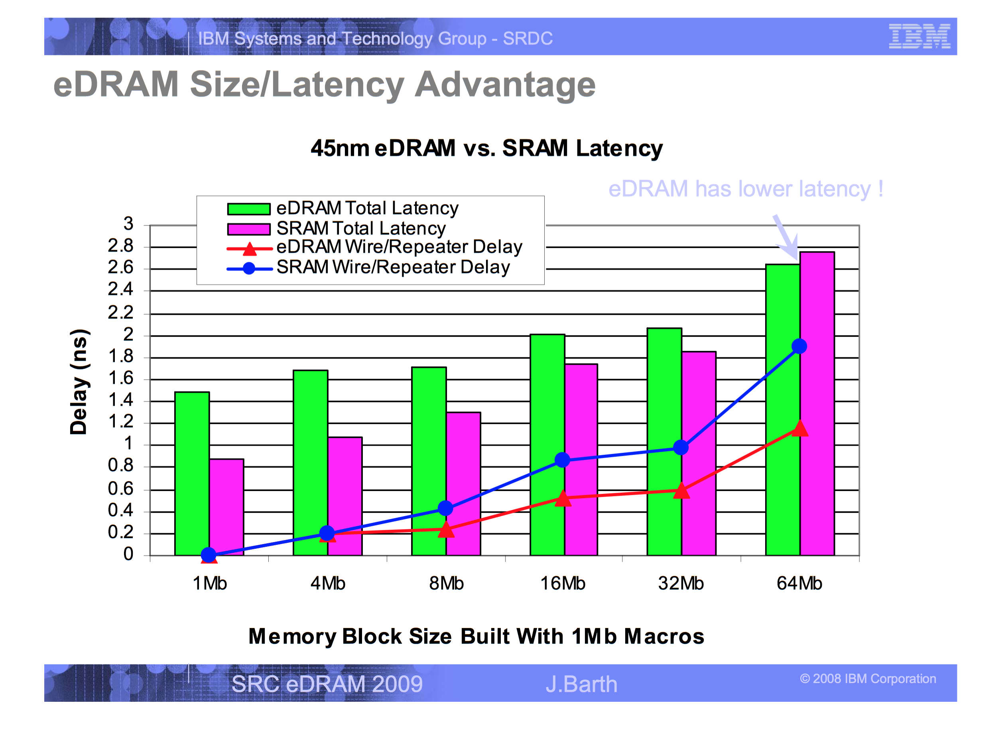

# HPC Intro

>“Software does not run in a magic fairy ether powered by the fevered dreams of
>CS PhDs” Branimir Karadzic

--

1. Hardware recap
Note:
test

---


--


<!--electricy, pn, diode, transistor, pipe analogy-->

---

Logical AND


<!--How can logical AND be imeplemented. Note the difference between PN elements production process.-->

---

## Закон на Мур

> Броят на транзисторите в един чип се удвоява приблизително всеки 12/18/24 месеца

Валиден ли е все още ?

<!--
Point that there is wide spread missleading information, that the law is invalid (it will be probably in 10 years, it is not now). Intel/Samsung 14nm. Change in materials and technology needed, though. Point that this is not a law, but more a self-fullfing prohpecy.-->


---


---

Да, но ...

---

Нещо се случва през 2005



<!--multiple reasons for that to happen - power wall, ilp wall, memory wall. Smartphones with 10+ cores-->

---


Защо компютрите вече не стават по-бързи ?

* Не стават ли ?

* До преди 2005 - на всеки Х месеца броят на транзисторите се удвоява по закона
  на Мур

* Това се случва посредством намаляне на размера на транзистора на чипа двойно

* Когато чипът е два пъти по-малък можем да вдигнем честотата два пъти

---

* size **L1 = L/2**

* voltage **V1 = V/2**

* frequency **F1 = 2F**

* density **D1 = 4D**

* power = **L \* V \* V \* F **
 * **P1 = 1/2 \* (1/2 \* 1/2 \* 2 \*2 \* 2)**
 * => **P1 = P**

 Обаче ...

<!--show why there was free lunch at the first place-->

---

Поради физични явления, вече не можем да намаляме **V**. Тоест ..


* size **L1 = L/2**

* voltage  <span style="color:red;">**V1 = V/2**</span>

* frequency **F1 = 2F**

* density **D1 = 4D**

* power = **L \* V \* V \* F **
 * **P1 = 1/2 \* 2 \*2 \* 2**
 * => <span style="color:red;">**P1 = 4P**</span>

<!--now when we can't decrease voltage, the power consumption goes up 4 times, so we can't afford that from point-->


---

**Static Power** - leakage of transistors while being inactive

**Dynamic Power** - energy needed to switch gate

<!--dynamic power is the power needed to change a transistor state. Before the leakage was negligable, is not like that today-->


---

 

<!--when these 2 lines colide we are having troubles-->


---

Ват на кв. см. в микропроцесорите

 

<!--another proof that the power consumption of the cpus is getting troublesome-->


---



<!--another proof that the power consumption of the cpus is getting troublesome-->


---

# Как работи процесора ?

<!--start of the sub-chapter that explains how the processor work-->

---

Straight forward:

1. Fetch
2. Decode
3. Execute
4. Write-back


<!--start to explain how the processor works. Note that what we will show is more a mental model, since the modern processor is a bit more complicated. Point that the modern processor has more stages (12 to 30 or more) -->

---

Има **3 начина** да получим по-голяма производителност - и това не се отнася
само до програмирането, ами изобщо

1. Работи по-усърдно / Work Harder

2. Работи по-умно / Work Smarter

3. Повикай помощ / Get Help

<!-- we have processor, it does what we want, now lets explore what are the ways to get more performance out of it -->

---

В контекста на процесорите:

1. Увеличена честота

2. Кешове / branch prediction / out of order / etc

3. Multicore / ILP / Auto SIMD


---

Pipeline

Do the CPU phases in parallel - write back result, as executing something else,
as decoding 3rd, as fetching 4th ..


Какви проблеми може да създаде това ?

<!-- first - pipelining. Using all the stages at the same time makes the processor xN (where n = length of the pipe) faster. Different type of hazards however arise, like memory dependence, control flow hazad or structural (multiple instructions want to use the same hardware) -->


---

Resolving dependencies

```
       for (int i = 0; i < numItems; ++i) {
            x = y[i] * z;    /// <----
            q += z + x + x;
            x = a + b;       /// <----
        }

        //////////////

        for (int i =0 ; i < numItems; ++i) {
            float x0 = y[i] * z;
            q += z + x0 + x0;
            x = a + b;
        }
```
<!-- sneak peak at some of the very basic ways to resolve memory dependence. Point that the compiler most often does this for us. -->


---

Resolving dependencies in **reduction**
```
for (int i = 0; i < size; ++i)
    m = max(arr[i], m);
```
Lets unroll ..
```
for (int i = 0; i < size / 4; i+=4) {
    m = max(arr[i], m);
    m = max(arr[i+1], m); /// <----
    m = max(arr[i+2], m); /// <----
    m = max(arr[i+3], m); /// <----
}
```
Fixed:
```
m0=m1=m2=m3=-inf;
for (int i = 0; i < size/4; i+=4) {
    m0 = max(m0, arr[i+0]);
    m1 = max(m1, arr[i+1]);
    m2 = max(m2, arr[i+2]);
    m3 = max(m3, arr[i+3]);
}
m = max(m0, m1, m2, m3);
```
<!-- sneak peak at some of the very basic ways to resolve memory dependence. Point that the compiler most often does this for us. Some of the modern compiler can recognize reduction, unroll and vectorize for us. However, reductions are still tricky for the compilers, and it is not a bad idea to help them -->

---

Lets assume we live in a perfect world, where CPUs are not power limited.

How fast can a CPU go ?

<!-- point that even if the power consumption wasn't such a problem, we still can't have the ultimate CPU. Point the difference between frequency and latency - you can send 100GHZ signal on the wire, but this doesn't change the latency of the signal -->

---

100ghz sounds fair

100ghz = 100 000 000 000 hz = 1e11hz -> 1e-11s (= 0.01ns)

Най-дългото разстояние, което може да бъде преминато за това време е 1е-11s * 300km/s = 3mm

---

## 3mm

Максималната честота е ограничена от скороста на най-бавният елемент в конвейра(пайплайна).

<!-- So know we know the difference between latency and frequency. Since each part of the pipeline has latency, the max frequency our CPU can go is 1/(theSlowestLatency). Otherwise at the same time we will need the hardware to do two different things. So we need to make the pipelines stages as small as we can -->

---

Superpipelined processors


Какви проблеми може да създаде това ?

<!-- So, the stages are smaller and we can run faster and this is great. However this rises the ability for hazards a lot. Also, a stall becomes more and more expensive -->

---

ILP - Instruction Level Parallelism

Super scalar processors

"Широчина на процесор"


Какви проблеми може да създаде това ?

<!-- The other way to make it fast is to get help. The processor have multiplied (parts of) the pipeline. Like 2 integer ALUs for example. This is implicit parallelism - make your code faster without you having to do anything. The wider the processor, the harder is to find what to feed it, since the pipes have to do independend stuff. ILP in the recent years (like 2015) gets better and better (4%-8% per year). -->


---

Superpipelined Superscalar Processor


<!-- Point that each modern processor today is superpipelined and superscalar. Since all of them are, it is often to not mention the "superpipelnied" word. It is often vendors to specify how wide the cores are. There could be different processors, for example with 1 pipe for fetch/decode/store and multiple one for execute. They can be combined in all kinds of ways, for example one of the execution pipes can do only float&int calcs, the other can do branch only -->

---



---



---

Resolving dependencies compile time ...

* Structural dependencies

* Data dependencies

* Controll dependencies

<!-- Talk about how pricy it is to deal with all these hazards. Think about if we can resolve them compile time. Point that due to power consumptions vendors like to turn off parts of the chips, when they are not used. Most of the hardware dealing with those hazards can not be turned off, however -->

---

Data dependencies detection is expensive.

Black Silicon (N.B. **SILICON != SILICONE**)

Out of order execution

Register renaming

---

VLIW 


Old AMD GPUs

nVidia Tegra K1

Intel Itanium

Elbrus

<!--Explain what the VLIW idea is. What are the cases when it works good (simple code constructions, like game shaders). Point that every VLIW implementation so far turned out to be failure. Point the specific compiler needs they have.-->


---


1. Валът на мощността (power wall)

2. Валът на паметта (memory wall)

3. Валът на имплицитният паралелизъм (ILP wall)


<!-- At this point we have to see that we can't make processors faster, ILP stops helping from some point due to memory hazards, bigger caches do not lead to so much faster execution (we havent talked for caches, but we will in a few slides).
-->

---


| Old        | New           |
| ------------- |:-------------:|
| Power is free, transistors are expensive      | Power Wall |
| Only dynamic power counts    | Static leakage is 40%      |
| Multiply is slow, load-and-store is fast | Memory wall      |
| ILP get better all the time, load-and-store is fast | ILP wall |
| Parallelization is not worth it | 75% per year before, 15% per year now    |
| Processor frequency goes up every X months | Number of cores goe up every X months      |

<!-- Point that many languages and technologies are ignoring these facts - like Python, JS, Swift. The world is not flat anymore and programmers have to change the way they code if they care for performance -->

---

* Single core performance per year ~(2 to 15)% per year

* Multicore performance increase ~75% per year

<!-- Another proof that the Moore's Law is totally okay. These are the results from the last 5-8 years. Single core improvements are mostly due to improved architectures/ILP/etc -->

---

FMAD double = 50pj

Moving 64b 1mm = 25pj

<!-- We are going to caches now. Since the processors are power limited, lets see how many power it takes to move data around -->

___


64b 10mm = 250pj

64b "off chip" = 1000pj

64b DRAM = 10000pj

12 TFLOPS ?= 300W
___

*"ALUs are like kids these days - easy to acquire, hard to feed" (B. Dally)*

<!-- point that doing 1 ALU calculation is often much cheaper than gettign the data to it. Point that many technologies (C++ included) are ignoring that fact and they are presenting the memory to the developer as it has the same access/store price.-->


---

“The Free Lunch Is Over: A Fundamental Turn Toward Concurrency in Software”
(2005, Sutter)

“30x CPU performance increases in the next 50 years” (2500x for the last 30
years)

“100 GHz CPU == Чип с размер 2 милиметра”

**Производителност = Паралелизъм**

**Ефикасност = Локалност**

Еднонишково оптимизираните процесори (и езици!) са отрицание на това ("светът е
плосък")

<!-- All we sayed so far in resume. Make a point on the Performance=Parallelism, Efficiency=Locality. If there is one thing ppl have to remember from this course, it is that -->


---

## Производителност = Паралелизъм

___

## Ефикасност = Локалност

---

## Ефективно, ефикасно или производително ? Има ли разлика въобще ?

<!-- We are not semantic nazis, but this bugs us (at least) me a lot. Explain the difference between effective (aka has the effect you like), efficient (has the effect you like, with lower efforts) and performance (which we can think of =efficiency in our context) -->

---


---

RAM is slow, so lets put faster caches near to the CPU

Automatically caches memory and instructions                                    
                                                                      


---



---

Why don't we put only caches ?

Speed of light - bigger the cache, longer the latency

From CPU to RAM (~30cm) and back takes 2ns !

SRAM vs DRAM vs GDRAM vs eDRAM vs HBM ?

---


SRAM
 
 * 6 transistors
 
 * May run on CPU clocks 
 
 * Fast, but hot
 
DRAM

 * 1 transistor, 1 capacitor (production of C is nice)
  
 * Much slower (<300MHZ as of today)
 
 * Slow, but dense

---




---

In a nutshel - two significantly different technologies

Both of them implemented as a 2D array (**reduce distance**)

Row & Column ID, decode. Reading a row is faster.

"My computer has **1033/1600/1866MHZ**, so you guys are talking about some DRAMs for the past, right?"

---

## Wrong.


It is just marketing done well.

---

Okay, so what about GDRAM and eDRAM ?


---

HBM


---



---

Classifying Caches

* Fully Associative

* Set Associative 

* Direct Mapped

---

#Q & A