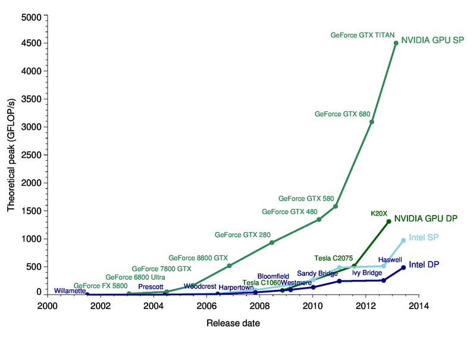

#GPGPU Intro

---

GPU 

* What is a GPU ?
>A graphics processor unit (GPU), also occasionally called visual processor unit (VPU), is a specialized electronic circuit designed to rapidly manipulate and alter memory to accelerate the creation of images in a frame buffer intended for output to a display. GPUs are used in embedded systems, mobile phones, personal computers, workstations, and game consoles

---


---

What is GPGPU ?
* Using GPUs for general purposing programming (history note)
* GPGPU get mainstream after 2008
* The idea is to use the GPU not only for graphics, but for general purpose computing

---

## Using GPUs for general purpose programing ?


---



---

GPU
* The GPU is huge SIMD machine designed for embarrassingly parallel tasks (like CG)

Programming Model:
* Each SIMD lane is a different thread (some call it SIMT)
* Write the program as only one SIMD lane will execute it
* Run it on thousands of lanes, each lane operating on different data
* Synchronization on global level is **not possible** (but there are atomics)
 * This is fundamental
 * So you don't have to worry about synchronization
 * But problems that require synchronization are harder (some impossible) to do

---

## APIs

Each API has two parts - C/C++ API to send tasks & data to the device (1) and C-based language, used to write programs for the device (2)

1. OpenCL (Khronos)
2. Metal (Apple)
3. Direct Compute (Microsoft)
4. CUDA (nVidia)
5. RenderScript (Google)

---

C++
```
void sum(float* a, float* b, float* res, int count) { 
    for (auto i = 0; i < count; ++i)
        res[i] = a[i] + b[i]
}
```
```
sum(a, b, res);
```

GPGPU
```
kernel void sum(float* a, float* b, float* res, int count) {
    int id = get_global_id(0);
    if (id > count) return;
    res[id] = a[id] + b[id];
}
```
```
device.transfer(a);
device.transfer(b);
device.transfer(res);
device.execture("sum");
device.getResult(res);
```

---

OpenCL 1.X
* Use all computational resources in the system — CPUs, GPUs and others
* Based on C99
 * Data- and task- parallel computational model
 * Abstract the specifics of underlying hardware

---

A modern platform includes:
* One or more CPUs
* One or more GPUs
* Optional accelerators (for example Xeon Phi)

Write once, run everywhere concept

---

Host & Device


---

## Host

