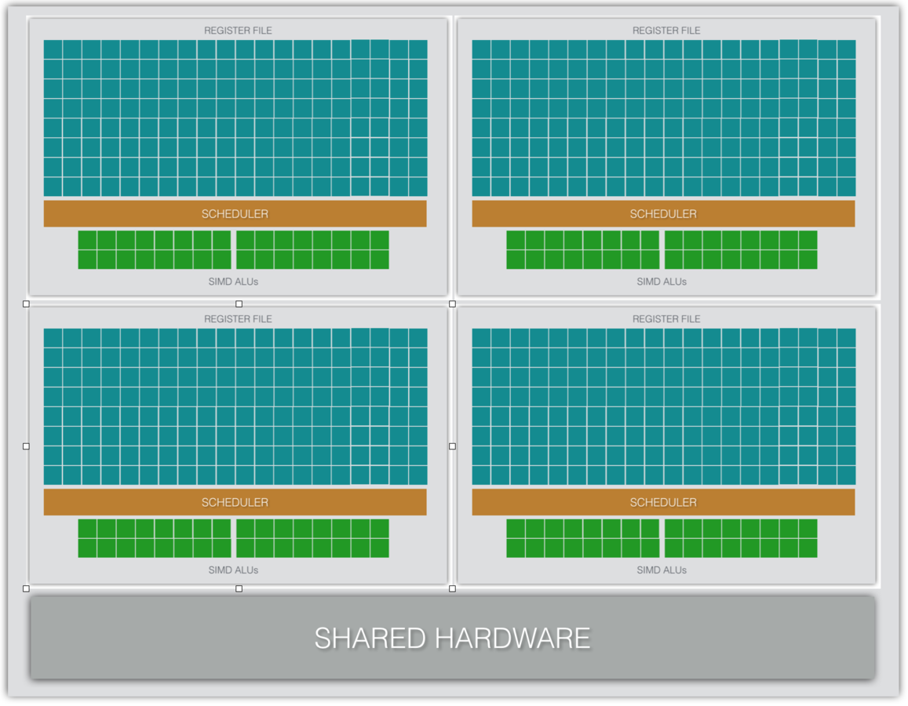
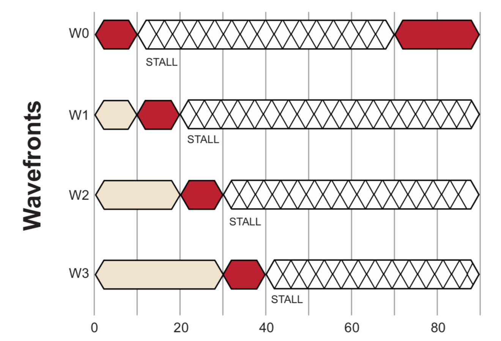
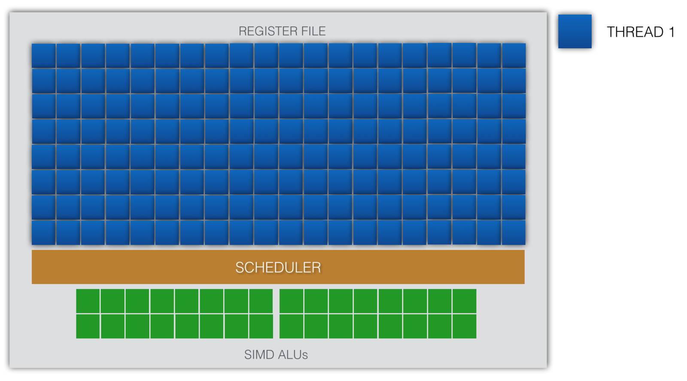
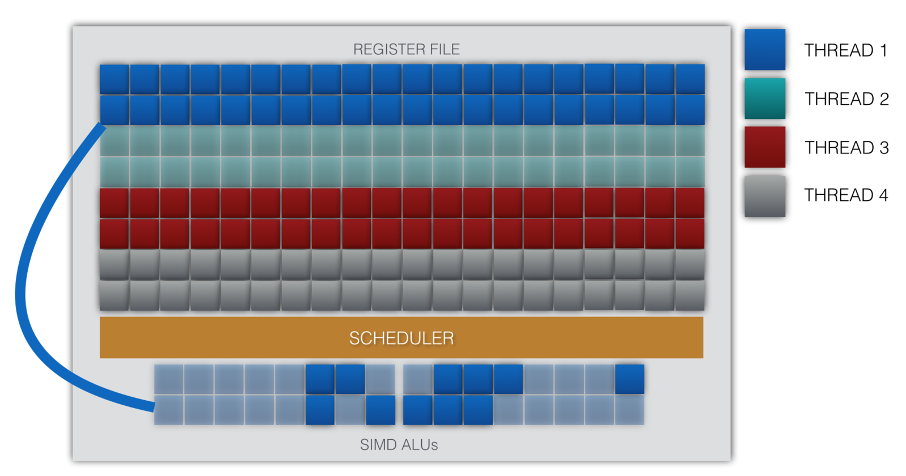

#GPGPU Intro


---

1. **Intro**
 * Domain, APIs, Thread and Memory models
2. OpenCL
3. CUDA
4. Shared memory
5. Performance considerations
6. Parallel design patterns

---

GPU 

* What is a GPU ?
>A graphics processor unit (GPU), also occasionally called visual processor unit (VPU), is a specialized electronic circuit designed to rapidly manipulate and alter memory to accelerate the creation of images in a frame buffer intended for output to a display. GPUs are used in embedded systems, mobile phones, personal computers, workstations, and game consoles

---


---


---

What is GPGPU ?
* Using GPUs for general purposing programming (history note)
* GPGPU get mainstream after 2008
* The idea is to use the GPU not only for graphics, but for general purpose computing

---

## Using GPUs for general purpose programing ?


---


---

GPU
* The GPU is huge SIMD machine designed for embarrassingly parallel tasks (like CG)

Programming Model:
* Each SIMD lane is a different thread (some call it SIMT)
* Write the program as only one SIMD lane will execute it
* Run it on thousands of lanes, each lane operating on different data
* Synchronization on global level is **not possible** (but there are atomics)
 * This is fundamental
 * So you don't have to worry about synchronization
 * But problems that require synchronization are harder (some impossible) to do

---

## APIs

Each API has two parts - C/C++ API to send tasks & data to the device (1) and C-based language, used to write programs for the device (2)

1. OpenCL (Khronos)
2. Metal (Apple)
3. Direct Compute (Microsoft)
4. CUDA (nVidia)
5. RenderScript (Google)

---

C++
```
void sum(float* a, float* b, float* res, int count) { 
    for (auto i = 0; i < count; ++i)
        res[i] = a[i] + b[i]
}
```
```
sum(a, b, res);
```

GPGPU
```
kernel void sum(float* a, float* b, float* res, int count) {
    int id = get_global_id(0);
    if (id > count) return;
    res[id] = a[id] + b[id];
}
```
```
device.transfer(a);
device.transfer(b);
device.transfer(res);
device.execture("sum");
device.getResult(res);
```

---

OpenCL 1.X
* Use all computational resources in the system — CPUs, GPUs and others
* Based on C99
 * Data- and task- parallel computational model
 * Abstract the specifics of underlying hardware

OpenCL 2.0 & OpenCL 2.1

---

A modern platform includes:
* One or more CPUs
* One or more GPUs
* Optional accelerators (for example Xeon Phi)

Write once, run everywhere concept

---


---


---


---

## Performance = Parallelism

## Efficiency = Locality

The GPGPU APIs are designed refleting that fact

---

## Thread Model

* Have a parallel problem.
* Write a program as it will be executed on **one thread**.
 * Each thread gets **unique id** (using API call). 
 * Using that, each thread can fetch unique data to operate on (we don't want all the threads to calculate the same thing over and over again).

---

## Thread Model

* Threads are grouped into blocks (different are calling that differently).
 * In fact, this is due to the fact, that each "thread" is a SIMD lane. The size of the block thus is the size of the GPU SIMD unit. 4 to 32 in the hardware today.
* Threads within a block can communicate via shared memory (more on this later).
* This allows them to cooperate in tasks (for example, caching data that all of the thread in the block will need).

---


---

## Thread Model
* The SIMD unit has a fixed number of lanes. How many threads can we launch ?
 * Obviously **n * sizeof(SIMD width)**
  * What if we don't have such exact number of tasks to give ?
* How many threads to give to the GPU ?

---


---



---


---


---


---


---



---




---

##solutions
* Prepare fewer threads (reduce occupancy or threads in flight)
* Register spill
* __noinline__
* Code trimming

---

##divergence

```__global__
void squareEvenOdd(int* a, int count) {
int id = globalThreadIdx();
if (id >= count) return;
if (id % 2) a[id] = a[id] * a[id];
else a[id] = 0;
}
```

---



---

## IT IS LIKE HYPERTHREADING ON STEROIDS

#### optimized for throughput, not latency

---

Memory types
* Registers X1
* Shared X5
* Global X100
* Constant - broadcast
* Caches (L1, L2, NC, other)

---

### Registers

```
int foo;
float bar[196];
Widget widget
void bar(float fizzBuzz) { // <-

}
```

* Every thread has **own view**.
* Possibly the most valuable resource you have.

---

### Global 

```
__global__ int* ptr;
float bar[196]; //! <-
Widget widget;
```

* The threads has the **same view** of the global memory.
* Most of the GPGPU apps are strugling with the global memory.
* What can be done ?
* Is HBM going to help ?

---

### Constant 

```
__constant__ int c[42];
```

* CUDA
* OpenCL 1.X
* OpenCL 2.X
* Same view of own view here ?

---

### Shared 

```
__shared__ int something[42];
```

* Block of threads has same view.
* Different block has different view.
* Most of the GPGPU apps are optimizing by finding a way to exploit the shared memory.
* The idea is to cache manually what is needed in the shared memory and use the shared memory instead of the global memory.


