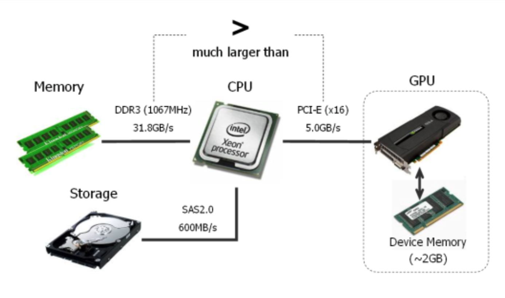
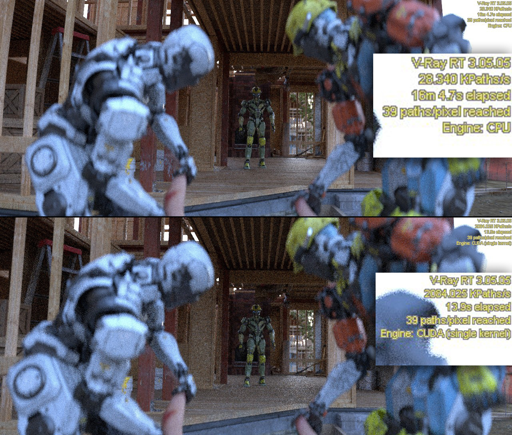
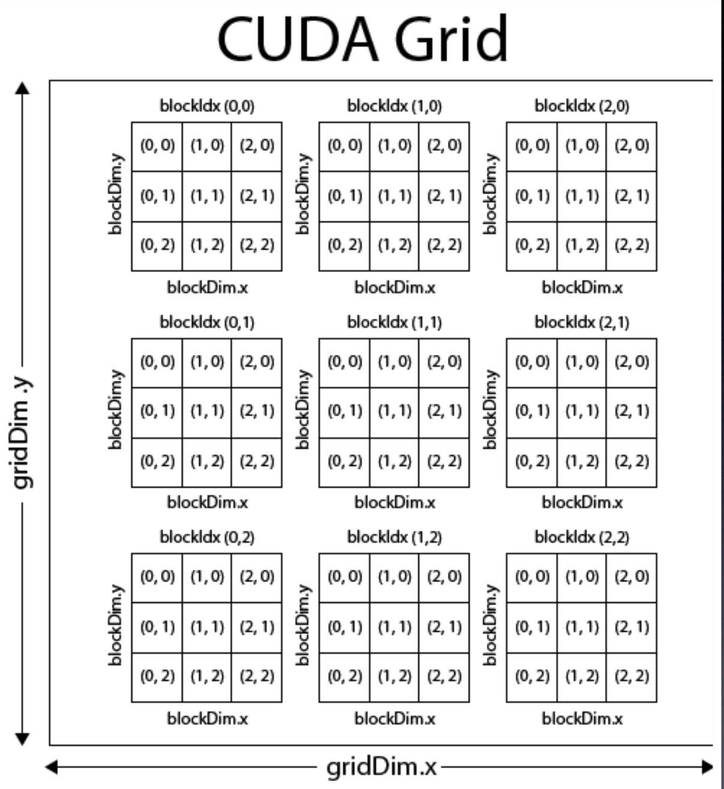
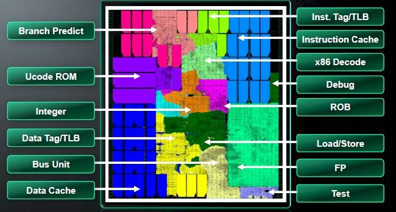
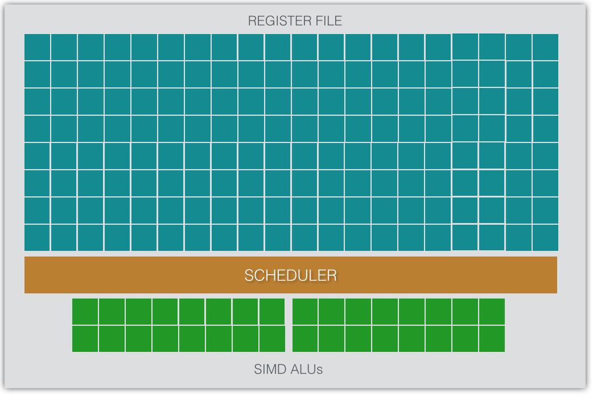
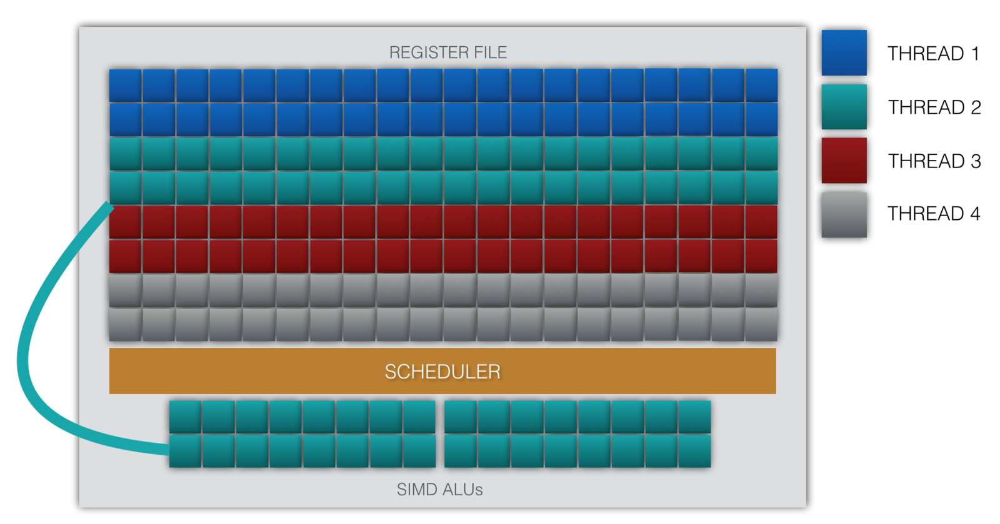
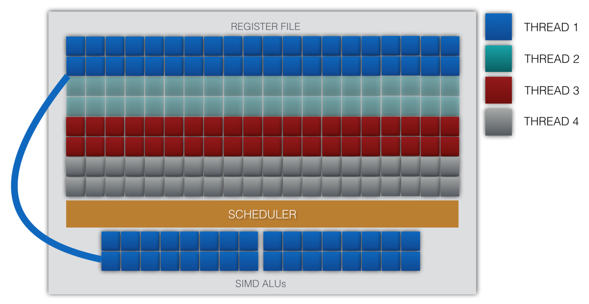
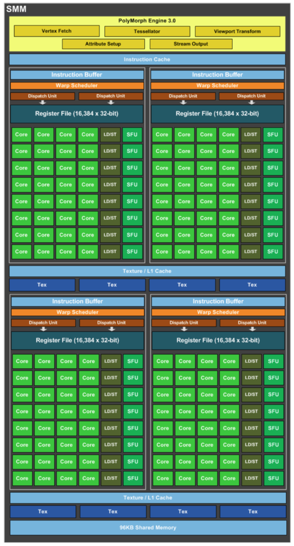

#GPGPU Intro


>Doing parallel programming is really easy, as long as you don't need it to run fast

---

#1. WHY GPGPU

---

GPU 

* What is a GPU ?
>A graphics processor unit (GPU), also occasionally called visual processor unit (VPU), is a specialized electronic circuit designed to rapidly manipulate and alter memory to accelerate the creation of images in a frame buffer intended for output to a display. GPUs are used in embedded systems, mobile phones, personal computers, workstations, and game consoles

---


---



---

What is GPGPU ?
* Using GPUs for general purposing programming (history note)
* GPGPU get mainstream after 2008
* The idea is to use the GPU not only for graphics, but for general purpose computing

---

## Using GPUs for general purpose programing ?


---

* Moores law
* Wall
 * ILP
 * Memory
 * Power

---

Single core gets up to 15% faster per year

Multi core gets up to 75% faster per year

FMAD double = 50pj

Moving 64b 1mm = 25pj

--

i7 = 2000pj per instruction

Fermi = 200pj per instruction

---


---



---

#Why the GPU runs so fast ?

---

* Latency
 * How fast a car can go on this road?

* Bandwitdh
 * How many cars can go on this road at the same time ?

* Throughput 
 * How many cars can go on this road for an hour ?

The GPUs are designed for throughput. What does this means and why this is the case ?

What is the CPU designed for ?

---

## Performance = Parallelism

## Efficiency = Locality

GPGPU is taking that into account

---

* The GPU is huge SIMD machine designed for embarrassingly parallel tasks (like CG)

Programming Model:
* Cache **hierarchy** (memory type is explicitly declared in code)
* Each SIMD lane is a different thread (some call it SIMT)
* Write the program as only one SIMD lane will execute it
* Run it on **thousands** of lanes(threads), each lane(thread) operating on different data
* Fundamental: synchronization on global level is **not possible** (but there are atomics)
 * So you **don't have to worry about synchronization**
 * But problems that require synchronization are harder (some impossible) to do

---

#2. APIs for GPGPU

---

Each API has two parts - C/C++ API to send tasks & data to the device (1) and C-based language, used to write programs for the device (2)

1. OpenCL (Khronos) - **everywhere\***
2. Metal (Apple) - OS X & iOS
3. Direct Compute (Microsoft) - Windows
4. CUDA (nVidia) - nVidia
5. RenderScript (Google) - Android

In contrast, APIs for graphics* are OpenGL, DirectX, Metal, Vulcan

---

GPGPU API goals
* Use (all computational) resources in the system — CPUs, GPUs and others
* Based on C99
* Data- and task- parallel computational model
* Abstract the specifics of underlying hardware

---


GPGPU APIs view of the system

-

Host (CPU) can send data to multiple devices (CPUs, GPUs, Accelerators)

-

Each device has piece of code compiled for each architecture, 
which the host can invoke.

---

## GPU Architectures:
1. Intel (desktop & mobile)
2. nVidia (desktop & mobile)
3. AMD (desktop & mobile)
4. ARM (mobile)
5. Imagination (mobile)
6. Qualcomm (mobile)
7. & Others

---

## Device Thread Model

* Have a parallel problem.
* Write a program as it will be executed on **one thread**.
 * Each thread gets **unique id** (using API call). 
 * Using that, each thread can fetch unique data to operate on (we don't want all the threads to calculate the same thing over and over again).

---

## Device Thread Model

* Threads are grouped into blocks (different are calling that differently).
 * In fact, this is due to the fact, that each "thread" is a SIMD lane. The size of the block thus is the size of the GPU SIMD unit. 4 to 32 in the hardware today.
* Threads within a block can communicate via shared memory (more on this later).
* This allows them to cooperate in tasks (for example, caching data that all of the thread in the block will need).

---



---

## Device Thread Model
* The SIMD unit has a fixed number of lanes. How many threads can we launch ?
 * Obviously **n * sizeof(SIMD width)**
  * What if we don't have such exact number of tasks to give ?
* How many threads to give to the GPU ?
* Designed to scale with hardware

---

#Hiding latency with multithreading

---

So far ...

ILP, cache, hyper threading, branch predictor, out of order execution, register renaming

---



The GPU has totaly different approach !

---



---


---


---



---



---


---


---


---

##solutions
* Prepare fewer threads (reduce occupancy or threads in flight)
* Register spill
* Function call
* Code generation

---

##divergence

```__global__
void squareEvenOdd(int* a, int count) {
    int id = globalThreadIdx();
    if (id >= count)
        return;
    if (id % 2)
        a[id] = a[id] * a[id];
    else 
        a[id] = 0;
}
```

---


---

##solutions
* Ignore
* Multi kernel

---



---

## IT IS LIKE HYPERTHREADING ON STEROIDS

#### optimized for throughput, not latency

---

Okay, but how does this looks in code ?

C++
```
void sum(float* a, float* b, float* res, int count) { 
    for (auto i = 0; i < count; ++i)
        res[i] = a[i] + b[i]
}
```
```
sum(a, b, res);
```

GPGPU
```
kernel void sum(float* a, float* b, float* res, int count) {
    int id = get_global_id(0);
    if (id > count) return;
    res[id] = a[id] + b[id];
}
```
```
device.transfer(a);
device.transfer(b);
device.transfer(res);
device.execture("sum");
device.getResult(res);
```

---

Difference between the CPU and the GPU thread models 

| CPU        | GPU           |
| ------------- |:-------------:| 
| Threads are expensive, no sense to have more threads than cores | Threads are cheap, make millions | 
| Context switch is expensive     | Cheap and happens every cycles      | 
| Branch can be expensive, but most of the time is cheap | Most often, branches are really expensive  | 
| Writing a lot code does not hurt the perfromance | Writing a lot code **might** hurt the perfromance |

---

**Millions** of threads are send to the driver 

**Tens of thousands** of threads are prepared on the GPU for execution

**Thousands** of threads are running at the same time

---

# Memory model

---

Device and host are having physically different memories

You have to copy that back on forth (memcpy-like)*

---

* Device memory
 * Registers X1
 * Shared X5
 * Global X100
 * Constant - broadcast
 * Caches (L1, L2, NC, other)

* Host memory

---


---

### Registers

```
int foo;
float bar[196];
Widget widget
void bar(float fizzBuzz) { // <-

}
```

* Every thread has **own view**.
* Possibly the most valuable resource you have.

---

### Global 

```
__global__ int* ptr;
float bar[196]; //! <-
Widget widget;
```

* The threads has the **same view** of the global memory.
* Most of the GPGPU apps are strugling with the global memory.
* What can be done ?
* Is HBM going to help ?

---

### Constant 

```
__constant__ int c[42];
```

* CUDA
* OpenCL 1.X
* OpenCL 2.X
* Shared view or own view here ?

---

### Shared 

```
__shared__ int something[42];
```

* Block of threads has same view.
* Different block has different view.
* Most of the GPGPU apps are optimizing by finding a way to exploit the shared memory.
* The idea is to cache manually what is needed in the shared memory and use the shared memory instead of the global memory.

---


---


---

# Q&A
