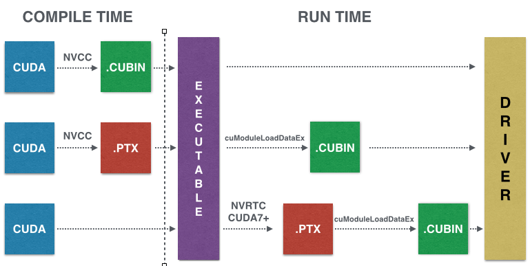
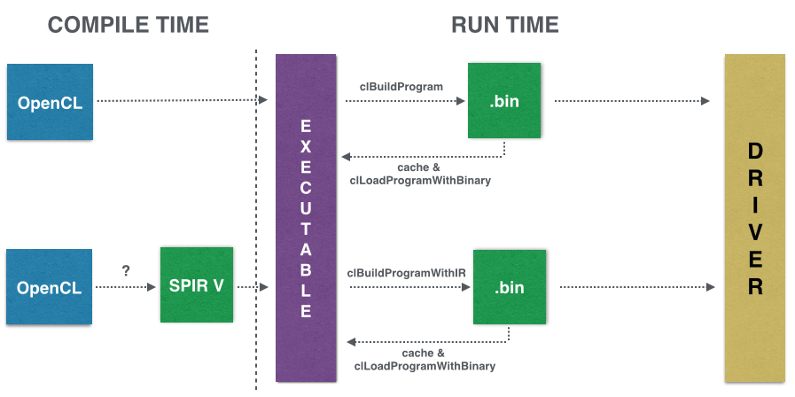
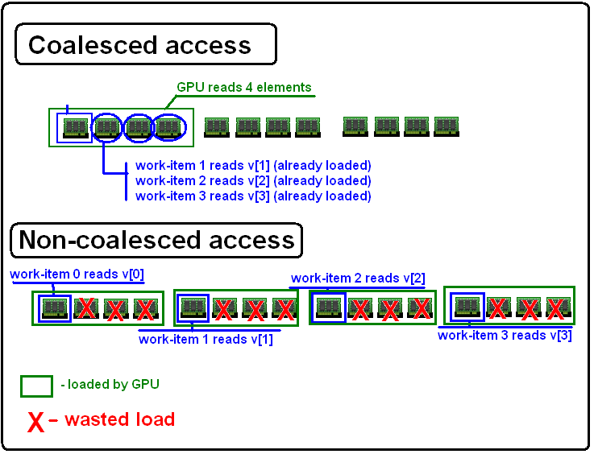
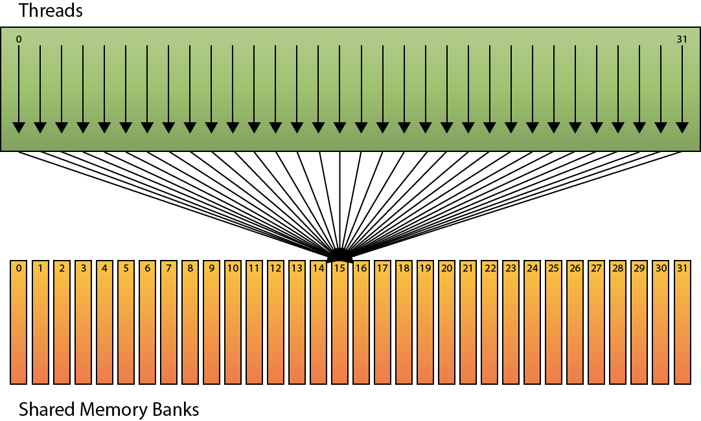
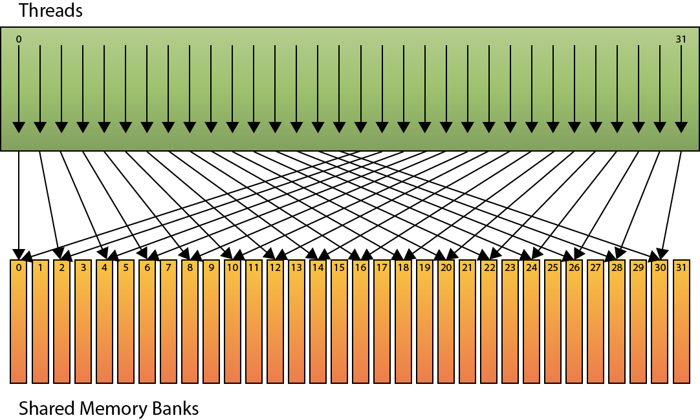
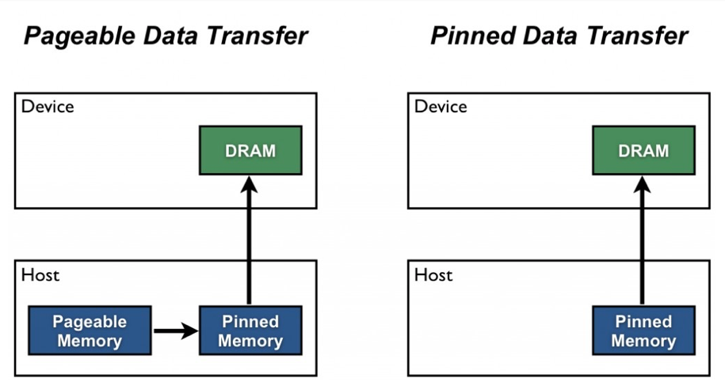
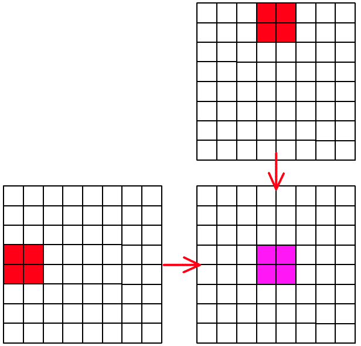
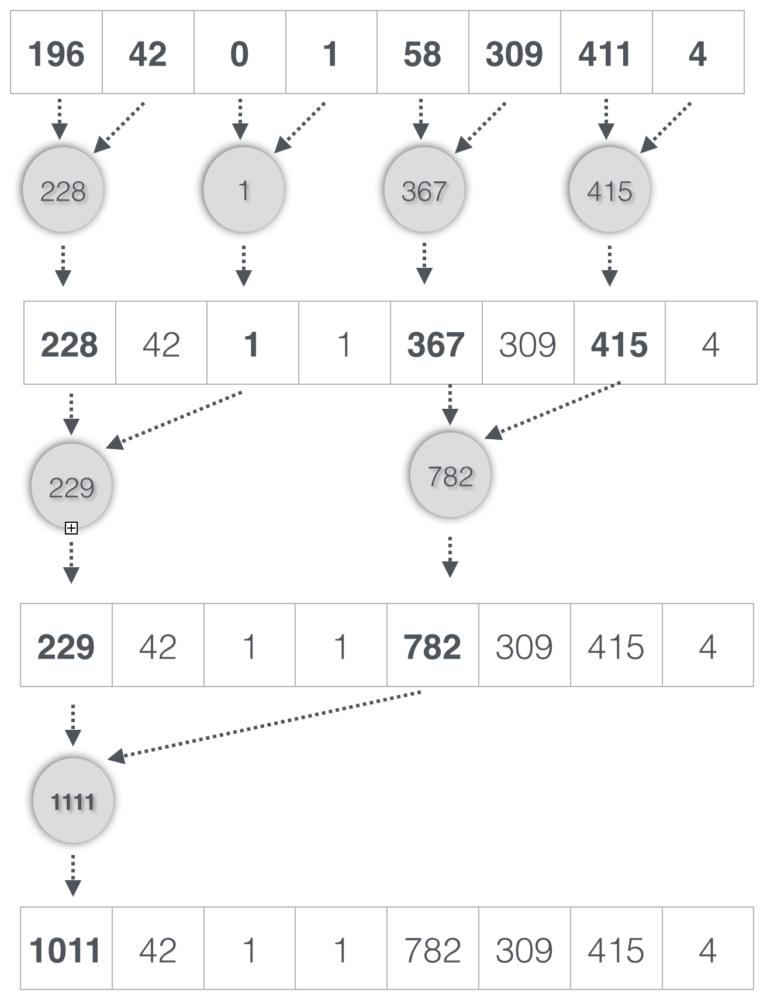
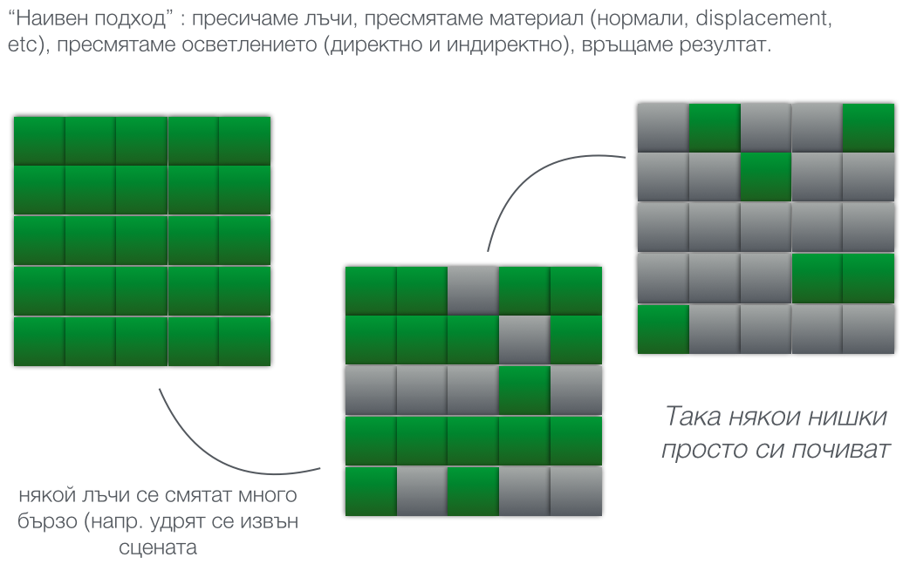
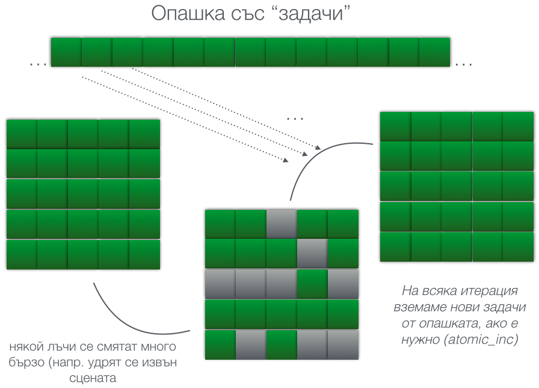

#GPGPU

Note:
code samples from cs-193-stanford

---

GPU:
* Can only access GPU memory
* No variable number of arguments
* No static variables
* Limited recursion
* Limited polymorphism

Function must be declared with qualifeier:
* __global__, __device__, (__host__)

---

* All APIs are context-dependend 
 * What is a context ?

```
cuMemAlloc(gpu_id0, ptr, numBytes);
cuMemAlloc(gpu_id0, ptr, numBytes);
```
vs
```
pushCtx(gpu_id0);
cuMemAlloc(ptr, numBytes);
cuMemAlloc(ptr, numBytes);
popCtx(gpu_id0);
```
Context are stored in a stack.

Suitable when doing funciton calls.

---

Usually, there is 1 context for each device.

Many times we need to feed the device from multiple threads. This is done through **streams**.

Usually, there is 1 **stream** for each host thread.

---


---

## [DEMO OpenCL Hello World]

---

## [DEMO Thread Local & Global Index]

---

## [DEMO Race condition]

---

## [DEMO Crashing kernels]

---

CUDA compilation


---

OpenCL compilation


---

You have so many raw flops power, that almost all of the time you are memory bound

Re-calculating sometimes is better than caching.

Memory coalescing

SoA vs AoS

Most of the time spend optimizing is reducing the reads/write from/to memory

---

## Global memory



Proiflers can help.

---

## Shared memory

* Shared memory is (sometimes) banked

* Each shared memory unit is implemented with multiple memory banks

* If 2 or > thread access different values rom the same bank, you get a conflict, meaning that the requests are serialized

* It is a limited resource, so it can limit the occupancy

---



---



---

## [DEMO ADJ DIFF]

---

Pinned memory

```
CUresult err = cuMemHostAlloc( &buf, size, 0);
```

```
clCreateBuffer(clContext, CL_MEM_WRITE_ONLY | CL_MEM_ALLOC_HOST_PTR, size, NULL, &err);
```



---

## Registers

* It is a limited resource, so it can limit the occupancy

* Monitor the register usage

* Create function calls to reduce the register pressure
 * The programming guides claim that this makes no sense, but it does
 * `__noinline__ in CUDA`, `attribute((noinline))` in AMD OpenCL (driver 15.7+)

---

Reduce the number of parameters, that the kernels have
```
kernel void raytrace(float* vertexes, int* faces, float* normals,
                     float* uv, Node* nodes, Mesh* meshes ...) { ... }
device void intersectRay(float* vertexes, int* faces, float* normals, ...) { ... }
```
```
//call one time `setArgs` to set pointers
kernel void setArgs(SceneData* sceneData, float* vertexes, int* faces, ...) {
    sceneData->vertexes = vertexes;
    sceneData->faces = faces;
    ...
}
//call multiple times
kernel void raytrace(SceneData* sceneData) { ... }
kernel void intersectRay(SceneData* sceneData) {
    float* faces = sceneData->faces;
    //
}

```

---

```
while (hasWorkToDo) {
    launchKernel(kernel, param0,
                param1, param2, ... , paramN);
}
```

```
launchKernel(setParamsKernel, param
            param1, param2, ... , paramN,
            paramsHolder);
while (hasWorkToDo) {
    launchKernel(kernel, paramsHolder);
}
```

---

The GPGPU implementations are trying to spill as little registers as possible
 This is usually a good thing.

For bigger kernels however, the occupancy can be hurt really bad.

Some GPGPU APIs are allowing to limit the register usage per thread (--maxregcount).

Test.

---

It is possible however, to achieve better performance with lower occupancy.

>"Better Performance at Lower Occupancy", Volkov, GTC 2010

---

>Maxwell combines the functionality of the L1 and texture caches into a single unit. As with Kepler, global loads in Maxwell are cached in L2 only, unless using the LDG read-only data cache mechanism introduced in Kepler.

---

Intrinsics:
```
#if (__CUDA_ARCH__ >= 350)
    #define LDG(X) __ldg(&(X))
#else
    #define LDG(X) (X)
#endif //(__CUDA_ARCH__ >= 350)
int x = LDG(data);
```
Textures:
```
int x = tex1D<int>(texture0, offset);
Inline PTX:
```
PTX instruction 
```
ld.global.nc
```

nvcc:
```
#define CONST(T) const T* restrict 
CONST(int) x = ...
```

---

Other intrinsics.

sin -> 100, cos -> 100, sincos -> 150

```
void __sincosf(float x, float* sptr, float* cptr)
float x = sin(f);
float y = sin(f);
```

```
float __saturatef(float x);
float x = max(0.f, min(x, 1.f));
```
`--use-fast-math`

+other

---

The block runs with the speed of the slowest thread in it.
```
for (int i = 0; i < localIndex; ++i) {
    for (int j = 0; j < localIndex; ++j) {
        doComplexWork(j);
    }
}

```

CUDA occupancy calculator

Registers using -xptxas -v

---

function inlining

__noinline__

multi kernel

---

## GPU Programming patterns

* Reduction

* Partition / Split

* Expand

---

## [DEMO Matrix multiply]

---



---


---

##[DEMO Matrix Multiply 2]

---

#reduction


```
//serial
float sum(float* data, int n) {
    float res = 0.f;
    for (int i = 0; i < n; ++i) result += data[i];
    return result;
}
```

## [DEMO SUM] (using atomic & using shared memory)

Tree-approach

---



---

## [DEMO Block Sum]

O(n) - serial

O(n/p + logn) - (p)arallel

---

Problem:

Variable number of elements per thread ?

-> parial sum (scan)


---

| 3 | 1 | 7 | 0 | 4 | 1 | 6 | 3 

| 0 | 3 | 4 | 11| 11| 15| 16| 22

---

## [DEMO inclusive scan]

---

* Sort
 * Counting sort
 * Odd-Even sort

```
while A is not sorted:
    if is_odd(i) and A[i+1] < A[i]
        swap(A[i+1], A[i]);
    barrier;
    if even(i) and A[i+1] < A[i]
        swap(A[i+1], A[i]);
    barrier
```

---

Ranking sort

```
rank[i] = count(j < i where A[j] <= A[i]) +
          count (j > i where A[j] < A[i])
permute(A[i], A[rank[i]])
```

---

Can be transformed to radix sort
```
a[i]==0, then
offset[i] = count(j < i where A[j] == 1)

a[i]==1, then
offiset[i] = count(j > i, where A[j] == 0)

permute(A[i], A[i - offset[i]))
```

How many ones/zeros to my left -> prefix sum
(for zeros invert the values)

---

# [DEMO Case study - GPU raytracer]

---

# [DEMO nSight profiling]

---

Recap

* nSight (-lineinfo)
* Shared mem
* Fast Math
* maxregcount

---



---



---


---

Q&A